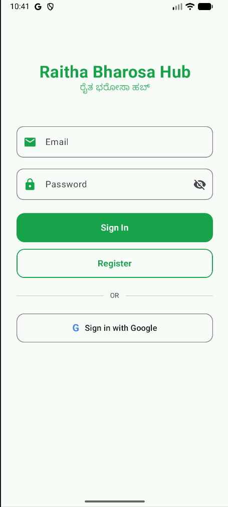
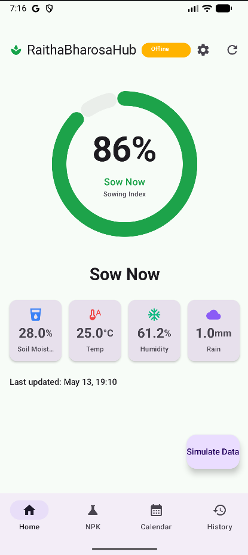
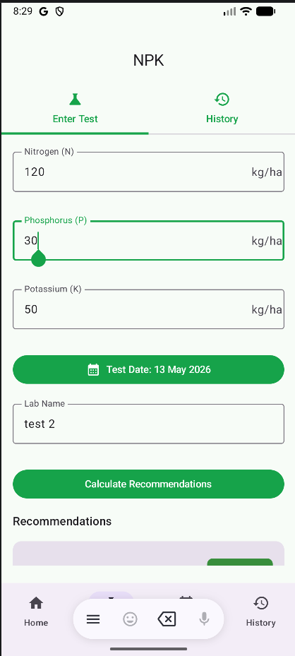
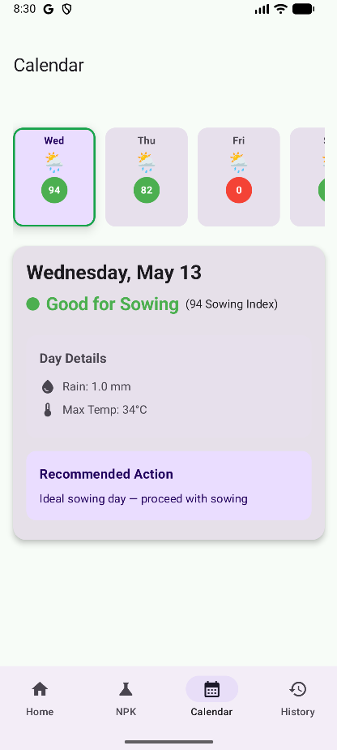
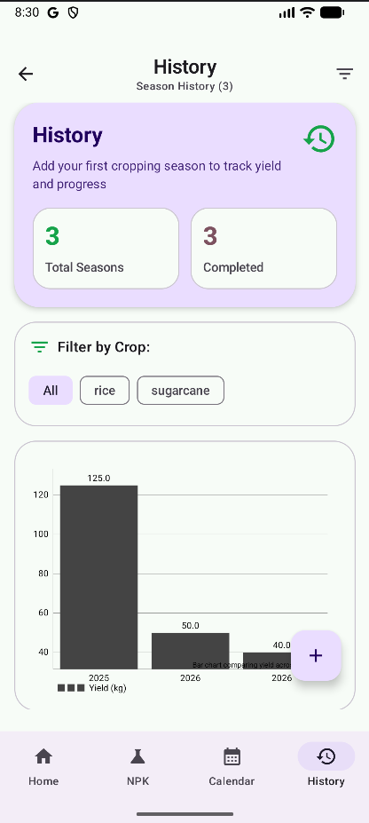
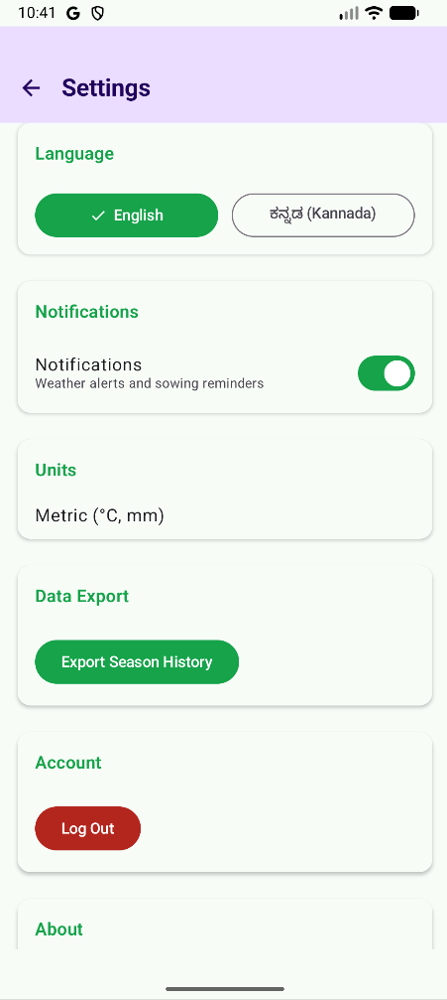

# Raitha Bharosa Hub (Raitha-Bharosa Hub)
> Smart Sowing Assistant for Karnataka Farmers

Raitha Bharosa Hub is an offline-first Android application designed to help Karnataka farmers make data-driven, localized decisions regarding sowing, crop management, and soil health. Built with a Kannada-first interface, it provides day-to-day actionable insights directly in the field.

## 🌾 Problem Statement
Agriculture in Karnataka relies heavily on localized weather patterns and monsoons. Farmers frequently face challenges accessing timely, accurate, and localized information regarding the best sowing periods, weather forecasts, and soil health (NPK levels) in their native language. Furthermore, unstable internet connectivity in remote rural areas makes relying on cloud-only solutions impractical. 

**Raitha Bharosa Hub** solves these issues by providing a robust offline-first digital assistant. It empowers farmers with precise sowing recommendations, customized NPK soil test insights, and a specialized agricultural calendar—all accessible without an active internet connection and fully localized in Kannada.

## ✨ Key Features
- **Kannada-First Localization:** Seamless onboarding, UI, and recommendations tailored for Kannada-speaking farmers.
- **Offline-First Architecture:** Engineered for low-connectivity environments using Room database and WorkManager, seamlessly syncing with Firebase when connectivity is restored.
- **Smart Sowing Assistant:** An intuitive dashboard featuring a circular sowing gauge that factors in weather, soil, and historical data to recommend the optimal sowing window.
- **NPK Recommendations:** Input NPK (Nitrogen, Phosphorus, Potassium) test results to receive tailored crop choices and fertilizer suggestions.
- **GPS Plot Pin Setup:** Pinpoint farm locations to fetch hyper-local weather forecasts and tailored soil insights.
- **7-Day Krishi Calendar:** An actionable, day-to-day farming calendar integrating upcoming weather outlooks.
- **Season History Tracking:** Log and review past crop performances, treatments, and yields for continuous improvement.
- **Secure Authentication & Sync:** Firebase Authentication for secure access and Firestore for reliable data synchronization across multiple devices.

## 🛠 Tech Stack
- **Language:** Kotlin
- **UI Toolkit:** Jetpack Compose, Material Design 3
- **Architecture:** MVVM (Model-View-ViewModel), Clean Architecture
- **Local Database:** Room DB
- **Remote Data & Sync:** Retrofit (OpenWeatherMap API), Firebase Auth, Firestore
- **Background Processing:** WorkManager
- **Dependency Injection:** Dagger Hilt

## 📂 Project Folder Structure
```text
com.raithabharosahub
├── data          # Local (Room) and Remote (Retrofit, Firebase) data sources, Repositories
├── di            # Dagger Hilt dependency injection modules
├── domain        # Core business logic, Use cases, Models, and Calculators
├── presentation  # UI layer containing Jetpack Compose screens and ViewModels
│   ├── auth      # Authentication flows
│   ├── dashboard # Main smart sowing dashboard
│   ├── npk       # NPK input and recommendations
│   └── ...       # Other feature screens (calendar, history, onboarding, settings)
├── sync          # Background synchronization logic and conflict resolution
├── ui.theme      # Material Design 3 theme definitions, typography, and colors
├── util          # Helper functions, extensions, and constants
└── workers       # WorkManager classes for background background tasks
```

## 📋 Prerequisites
- **Android Studio:** Latest version recommended (Giraffe/Hedgehog or newer)
- **Minimum SDK:** API 26 (Android 8.0 Oreo)
- **Java Version:** Java 17

## 🚀 Installation and Setup
1. **Clone the repository:**
   ```bash
   git clone https://github.com/puneeth-vemuri/RaithaBharosaHub.git
   ```
2. **Open the project** in Android Studio.
3. **Configure API Keys and Secrets:**
   Create or open `local.properties` in the root directory and add the following keys:
   ```properties
   OPENWEATHER_API_KEY=your_openweather_api_key_here
   DB_PASSPHRASE=your_secure_db_passphrase_here
   FIREBASE_WEB_CLIENT_ID=your_firebase_web_client_id_here
   ```
   > Get `FIREBASE_WEB_CLIENT_ID` from Firebase Console → Project Settings → General → OAuth 2.0 Web client ID.
4. **Configure Firebase:**
   Add your `google-services.json` file to the `app/` directory. Download it from Firebase Console → Project Settings → Your Apps.
5. **Sync Project:**
   Click "Sync Project with Gradle Files" to fetch all required dependencies.

## 📱 How to Run the App
1. Connect an Android physical device or start an Android Emulator running API 26 or higher.
2. Select the `app` run configuration in the Android Studio toolbar.
3. Click the **Run** button (or press `Shift + F10`) to build and install the application on your device.
4. *Optional:* To build a release version via the command line, run:
   ```bash
   ./gradlew assembleRelease
   ```

## 📸 Screenshots
| Login | Dashboard | NPK Calculator |
| :---: | :---: | :---: |
|  |  |  |

| Krishi Calendar | Season History | Settings |
| :---: | :---: | :---: |
|  |  |  |
## 🔮 Future Improvements
- **IoT Integration:** Direct integration with external IoT sensors for real-time tracking of soil moisture, NPK levels, and temperature.
- **AI Disease Detection:** Implement an ML model to detect crop diseases from photographs taken with the phone's camera.
- **Expanded Localization:** Add support for more regional dialects and other Indian languages.
- **Farmer Community Forum:** A dedicated hub for farmers to discuss local agricultural issues, share tips, and ask for expert advice.
- **Marketplace Integration:** Direct links or portals for procuring seeds, fertilizers, and equipment.

## 📄 License
This project is licensed under the MIT License - see the [LICENSE](LICENSE) file for details.

---
*Developed by Puneeth Vemuri · Journeymen G1 · MindMatrix VTU Internship Program · PRD #NO77*